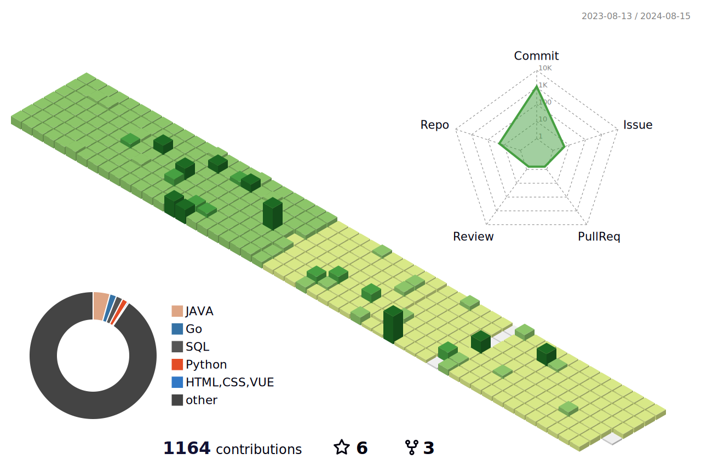

<h1 align="center">欢迎来到后端码农kun.yu的GitHub主页👋</h1>

 
   ❤️ 🍦 🍓 🍉 🍋 🥛 ☕ 🍗 🍟 🎮 💻 🎶 💰
 
 

- 🔭你好呀！💡

- 🤔这里是余堃的大象耳朵，会点大数据优化和性能分析优化，想做一个有意思的后端工程师

- ⚡ Fun fact:喜欢看书，喜欢看博客，喜欢听音乐，喜欢看电影，喜欢运动寻找灵感

**kun.yu/kun.yu** is a ✨ _special_ ✨ repository because its `README.md` (this file) appears on your GitHub profile.

Here are some ideas to get you started:

- 🔭 I’m currently working on ...
- 🌱 I’m currently learning ...
- 👯 I’m looking to collaborate on ...
- 🤔 I’m looking for help with ...
- 💬 Ask me about ...
- 📫 How to reach me: ...
- 😄 Pronouns: ...
- ⚡ Fun fact: ...
-
- 🚀 I use daily:
  
  
  
  
  
  
  
  
  
  

- 💻 I work using:
- 
  
  
  
  
  
  
  

- ⚙️ I also use and work:
  
  
  
  

- 🌱 I’m currently learning:
  

  

🔥 My projects:
-----------------------
个人博客hexo：
个人博客Docute：https://niubility666666.github.io/

🔥 My Skill Set:
-----------------------
<table><tr><td valign="top" width="33%">

<!--### Frontend  

  
  
  
  
  
  
  
  
  
  
  

</td><td valign="top" width="33%">
-->

### Backend  

  
  
  
  
  
  
  
  
  
  
  
   
  
  

</td><td valign="top" width="33%">

### DevOps  

  
  
  
  
  
  
  
  
  
  

</td></tr></table>  

   

## Connect with me  

  

  
  

   

## 📈Statistics

<!--   profile-night-rainbow.svg -->
<!---->

## Github Stats  

    
    

